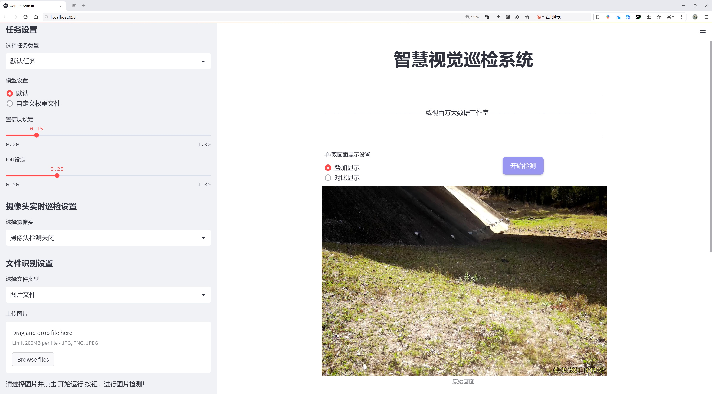
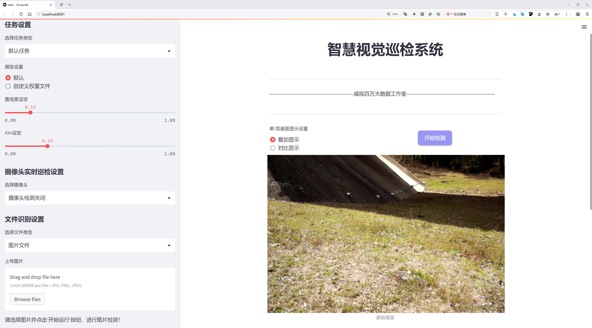
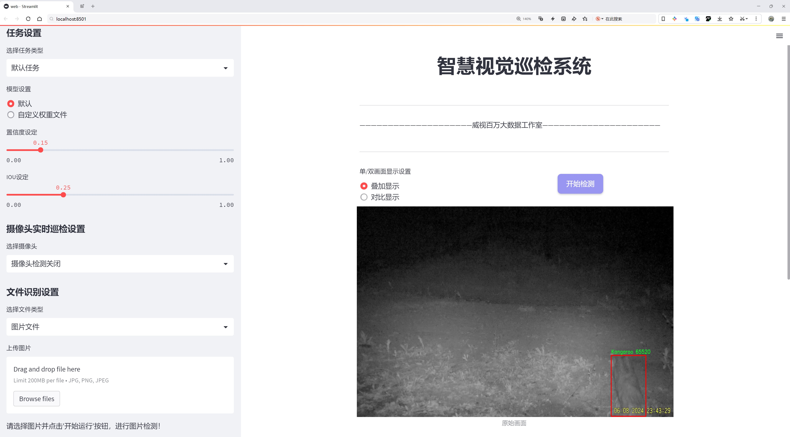
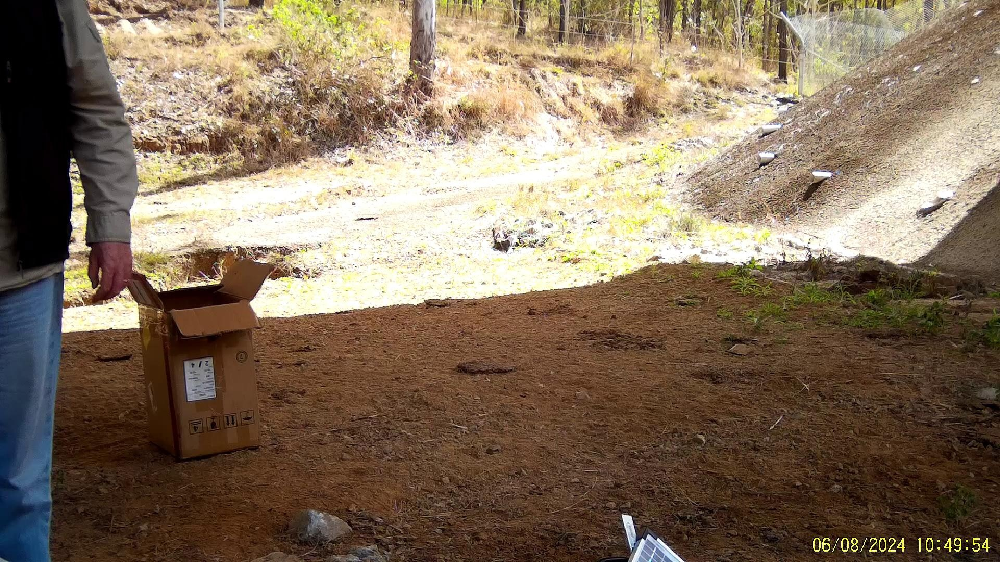
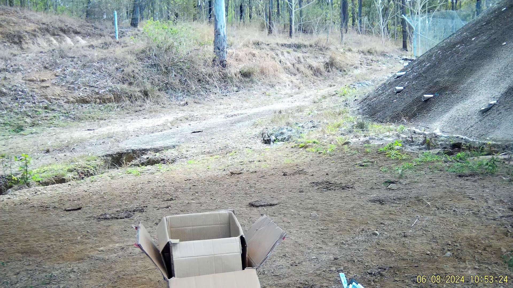
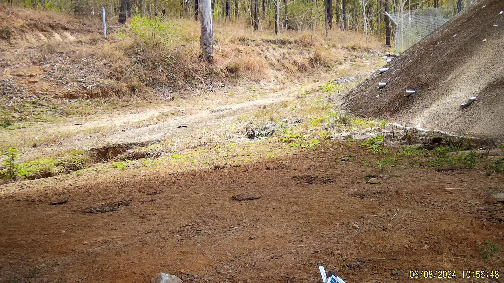
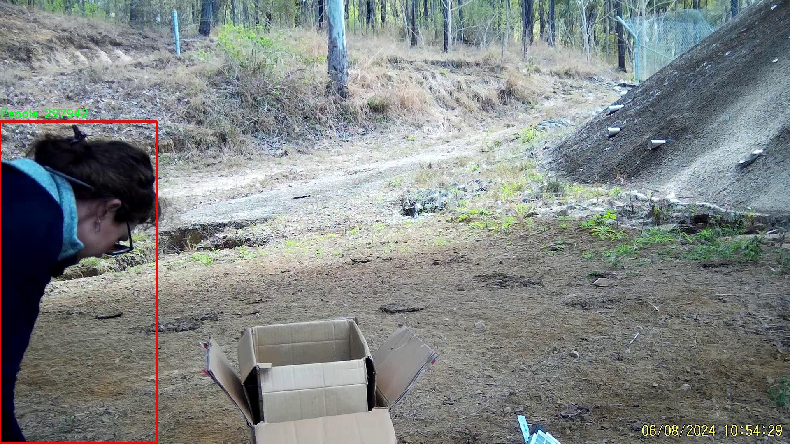
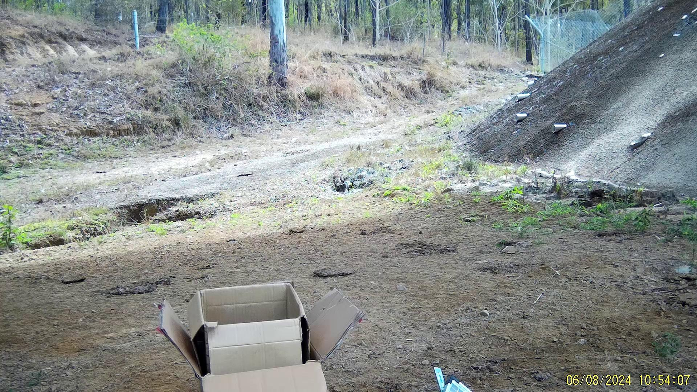

# 野生动物检测检测系统源码分享
 # [一条龙教学YOLOV8标注好的数据集一键训练_70+全套改进创新点发刊_Web前端展示]

### 1.研究背景与意义

项目参考[AAAI Association for the Advancement of Artificial Intelligence](https://gitee.com/qunshansj/projects)

项目来源[AACV Association for the Advancement of Computer Vision](https://gitee.com/qunmasj/projects)

研究背景与意义

随着全球生态环境的变化和人类活动的加剧，野生动物的栖息地受到严重威胁，导致许多物种面临灭绝的风险。因此，建立有效的野生动物监测与保护系统显得尤为重要。传统的野生动物监测方法往往依赖于人工观察和记录，效率低下且容易受到人为因素的干扰。近年来，计算机视觉技术的快速发展为野生动物监测提供了新的解决方案，尤其是基于深度学习的目标检测算法在这一领域展现出了巨大的潜力。

YOLO（You Only Look Once）系列算法因其高效的实时检测能力和较高的准确率，已成为目标检测领域的研究热点。YOLOv8作为该系列的最新版本，结合了更为先进的网络结构和训练策略，能够在复杂环境中快速、准确地识别多种目标。然而，尽管YOLOv8在多个领域取得了显著的成果，但在特定应用场景下，尤其是野生动物检测方面，仍然存在一定的挑战。这些挑战主要体现在不同物种的外观差异、背景复杂性以及光照变化等因素对检测精度的影响。

本研究旨在基于改进的YOLOv8算法，构建一个高效的野生动物检测系统，以实现对特定区域内多种野生动物的实时监测。为此，我们将利用Douglas_Week_1_Phase_2数据集，该数据集包含1600张图像，涵盖8个类别的野生动物，包括鸟类、牛、针鼹、狐狸、袋鼠、未知物种、人与负鼠等。这些类别的选择不仅反映了生态系统的多样性，也为模型的训练提供了丰富的样本，有助于提高检测的全面性和准确性。

通过对YOLOv8的改进，我们将重点解决以下几个问题：首先，如何在复杂背景下提高特定物种的检测精度；其次，如何通过数据增强和迁移学习等技术，提升模型在小样本情况下的学习能力；最后，如何实现模型的实时检测能力，以便在实际应用中满足野生动物监测的需求。研究的最终目标是开发出一个能够在多种环境条件下稳定运行的野生动物检测系统，为生态保护和生物多样性监测提供技术支持。

本研究的意义不仅在于推动计算机视觉技术在生态保护领域的应用，还在于为野生动物保护提供科学依据和数据支持。通过建立高效的监测系统，我们能够更好地了解野生动物的分布和行为模式，为制定保护措施提供数据支撑。此外，该系统的成功应用也将为其他领域的目标检测任务提供借鉴，推动深度学习技术的进一步发展。综上所述，基于改进YOLOv8的野生动物检测系统的研究，不仅具有重要的学术价值，也具有深远的社会意义。

### 2.图片演示







##### 注意：由于此博客编辑较早，上面“2.图片演示”和“3.视频演示”展示的系统图片或者视频可能为老版本，新版本在老版本的基础上升级如下：（实际效果以升级的新版本为准）

  （1）适配了YOLOV8的“目标检测”模型和“实例分割”模型，通过加载相应的权重（.pt）文件即可自适应加载模型。

  （2）支持“图片识别”、“视频识别”、“摄像头实时识别”三种识别模式。

  （3）支持“图片识别”、“视频识别”、“摄像头实时识别”三种识别结果保存导出，解决手动导出（容易卡顿出现爆内存）存在的问题，识别完自动保存结果并导出到tempDir中。

  （4）支持Web前端系统中的标题、背景图等自定义修改，后面提供修改教程。

  另外本项目提供训练的数据集和训练教程,暂不提供权重文件（best.pt）,需要您按照教程进行训练后实现图片演示和Web前端界面演示的效果。

### 3.视频演示

[3.1 视频演示](https://www.bilibili.com/video/BV1bktNeoEgK/)

### 4.数据集信息展示

##### 4.1 本项目数据集详细数据（类别数＆类别名）

nc: 8
names: ['Bird', 'Cattle', 'Echidina', 'Fox', 'Kangaroo', 'Not_Sure', 'People', 'Possum']


##### 4.2 本项目数据集信息介绍

数据集信息展示

在现代野生动物监测与保护的研究中，数据集的质量与多样性对模型的训练效果至关重要。本研究所采用的数据集名为“Douglas_Week_1_Phase_2”，其主要目的是为改进YOLOv8的野生动物检测系统提供高质量的训练样本。该数据集包含了8个不同的类别，具体类别包括：鸟类（Bird）、牛（Cattle）、针鼹（Echidina）、狐狸（Fox）、袋鼠（Kangaroo）、不确定（Not_Sure）、人类（People）以及负鼠（Possum）。这些类别的选择反映了澳大利亚特有的生态环境及其生物多样性，旨在帮助研究人员更好地理解和监测这些物种的分布与行为。

在数据集的构建过程中，研究团队通过多种方式收集和标注了大量的图像数据。这些图像涵盖了不同的时间段和环境条件，确保了数据集的多样性和代表性。例如，鸟类的图像可能在清晨或黄昏拍摄，以捕捉它们最活跃的时刻；而袋鼠的图像则可能在广阔的草原上拍摄，展现其自然栖息地。每个类别的样本数量经过精心设计，以确保模型在训练过程中能够学习到足够的特征，从而提高其检测精度。

在数据标注方面，团队采用了严格的标准，以确保每个图像中的动物都被准确标记。对于“Not_Sure”这一类别，标注者在面对不确定的动物或模糊的图像时，进行了详细的记录。这种标注策略不仅提高了数据集的可靠性，也为后续的模型训练提供了更为丰富的背景信息。通过这种方式，模型在面对不确定性时，能够更好地做出判断，从而提高整体的检测能力。

此外，数据集的构建还考虑到了不同物种之间的相似性和环境影响。例如，狐狸和负鼠在某些环境下可能会有相似的外观特征，而牛和袋鼠则可能在同一草原上共存。这种相似性使得模型在训练时需要更加关注细微的特征差异，以便能够准确区分不同物种。为此，数据集中包含了多种角度和距离的图像，以增强模型的泛化能力。

总的来说，“Douglas_Week_1_Phase_2”数据集不仅为YOLOv8的训练提供了丰富的样本，还通过多样化的类别和精确的标注策略，确保了模型在实际应用中的有效性与可靠性。随着对野生动物监测需求的不断增加，该数据集的应用前景广阔，能够为生态保护、物种监测以及人类活动影响评估等领域提供重要的数据支持。通过对这一数据集的深入研究与应用，研究人员将能够更好地理解生态系统的动态变化，并为保护生物多样性贡献力量。











### 5.全套项目环境部署视频教程（零基础手把手教学）

[5.1 环境部署教程链接（零基础手把手教学）](https://www.ixigua.com/7404473917358506534?logTag=c807d0cbc21c0ef59de5)


[5.2 安装Python虚拟环境创建和依赖库安装视频教程链接（零基础手把手教学）](https://www.ixigua.com/7404474678003106304?logTag=1f1041108cd1f708b01a)

### 6.手把手YOLOV8训练视频教程（零基础小白有手就能学会）

[6.1 手把手YOLOV8训练视频教程（零基础小白有手就能学会）](https://www.ixigua.com/7404477157818401292?logTag=d31a2dfd1983c9668658)

### 7.70+种全套YOLOV8创新点代码加载调参视频教程（一键加载写好的改进模型的配置文件）

[7.1 70+种全套YOLOV8创新点代码加载调参视频教程（一键加载写好的改进模型的配置文件）](https://www.ixigua.com/7404478314661806627?logTag=29066f8288e3f4eea3a4)

### 8.70+种全套YOLOV8创新点原理讲解（非科班也可以轻松写刊发刊，V10版本正在科研待更新）

由于篇幅限制，每个创新点的具体原理讲解就不一一展开，具体见下列网址中的创新点对应子项目的技术原理博客网址【Blog】：


[8.1 70+种全套YOLOV8创新点原理讲解链接](https://gitee.com/qunmasj/good)

### 9.系统功能展示（检测对象为举例，实际内容以本项目数据集为准）

图9.1.系统支持检测结果表格显示

  图9.2.系统支持置信度和IOU阈值手动调节

  图9.3.系统支持自定义加载权重文件best.pt(需要你通过步骤5中训练获得)

  图9.4.系统支持摄像头实时识别

  图9.5.系统支持图片识别

  图9.6.系统支持视频识别

  图9.7.系统支持识别结果文件自动保存

  图9.8.系统支持Excel导出检测结果数据


### 10.原始YOLOV8算法原理

原始YOLOv8算法原理

YOLOv8作为YOLO系列的最新成员，于2023年1月10日正式发布，标志着计算机视觉领域在目标检测、分类和分割任务上的又一次重要进步。相较于前代模型，YOLOv8在精度和执行速度上均展现出显著的优势，成为当前最先进的实时目标检测模型之一。其设计理念和架构的创新，使得YOLOv8不仅继承了YOLOv5的优良特性，还融合了YOLOv6、YOLOX等模型的设计优势，形成了一种更为高效的网络结构。

YOLOv8的核心在于其独特的网络架构，主要由输入端、主干网络、Neck端和输出端四个模块组成。输入端负责对输入图像进行预处理，采用了多种数据增强技术，如Mosaic数据增强、自适应图片缩放和灰度填充等，以提高模型的鲁棒性和泛化能力。主干网络则通过卷积、池化等操作提取图像特征，使用了改进的C2f模块，该模块在C3模块的基础上增加了更多的跳层连接和Split操作，从而有效地保留了特征信息并增强了模型的学习能力。

在Neck端，YOLOv8依然采用了PAN（Path Aggregation Network）结构，通过上下采样和特征拼接的方式，融合不同尺度的特征图，以便于后续的目标检测。此部分的设计使得模型能够更好地处理多尺度目标，尤其是在复杂背景下的小目标检测。输出端则引入了新的解耦合头结构，取代了传统的Anchor-Based检测方法，采用Anchor-Free的策略，使得目标的分类和回归过程相互独立，从而提高了检测精度和速度。

YOLOv8的创新不仅体现在网络结构上，还包括其新的损失函数设计。与YOLOv5相比，YOLOv8在损失计算方面进行了改进，采用了BCELoss作为分类损失，结合DFLLoss和CIoULoss作为回归损失。这种新的损失函数组合，旨在提高模型的学习效率和泛化能力，使其在各种复杂场景下均能保持良好的性能。

值得注意的是，YOLOv8在设计时充分考虑了不同硬件平台的适应性，能够在从CPU到GPU的各种环境中高效运行。这一特性使得YOLOv8不仅适用于学术研究，也为工业应用提供了强有力的支持。此外，YOLOv8还支持姿态评估和高分辨率图像检测，进一步拓宽了其应用场景。

在具体实现上，YOLOv8的主干网络采用了新的卷积核设计，将第一个卷积层的kernel从6x6调整为3x3，这一变化有效地提高了特征提取的细腻度和准确性。同时，主干网络中的C2f模块的结构也进行了优化，调整了block的数量和配置，以适应不同规模的模型需求。YOLOv8提供了多种模型版本，包括n、s、m、l、x五种不同规模的模型，以满足不同应用场景的需求。

总的来说，YOLOv8在继承YOLO系列模型优良传统的基础上，通过多项创新，极大地提升了目标检测的精度和速度。其在复杂环境下的小目标检测能力，结合高效的网络结构和灵活的损失函数设计，使得YOLOv8成为当前计算机视觉领域中不可或缺的重要工具。未来，随着YOLOv8的不断发展和优化，其在实际应用中的潜力将更加广阔，为各类视觉任务提供更加可靠的解决方案。


### 11.项目核心源码讲解（再也不用担心看不懂代码逻辑）

#### 11.1 70+种YOLOv8算法改进源码大全和调试加载训练教程（非必要）\ultralytics\models\yolo\pose\__init__.py

以下是对给定代码的核心部分进行提炼和详细注释的结果：

```python
# Ultralytics YOLO 🚀, AGPL-3.0 license

# 从当前包中导入三个类：PosePredictor、PoseTrainer 和 PoseValidator
from .predict import PosePredictor  # 导入用于姿态预测的类
from .train import PoseTrainer      # 导入用于训练模型的类
from .val import PoseValidator       # 导入用于验证模型的类

# 定义模块的公共接口，指定可以被外部访问的类
__all__ = 'PoseTrainer', 'PoseValidator', 'PosePredictor'
```

### 代码分析与注释

1. **模块导入**：
   - `from .predict import PosePredictor`：从当前包的 `predict` 模块中导入 `PosePredictor` 类，该类负责处理姿态预测的相关功能。
   - `from .train import PoseTrainer`：从当前包的 `train` 模块中导入 `PoseTrainer` 类，该类用于训练姿态估计模型。
   - `from .val import PoseValidator`：从当前包的 `val` 模块中导入 `PoseValidator` 类，该类用于验证训练好的模型的性能。

2. **公共接口定义**：
   - `__all__` 变量用于定义模块的公共接口，只有在使用 `from module import *` 语句时，列出的类才会被导入。这里列出了 `PoseTrainer`、`PoseValidator` 和 `PosePredictor`，意味着这三个类是模块的核心功能部分，用户可以直接使用它们进行模型训练、验证和预测。

通过这样的结构，代码实现了模块化设计，使得各个功能的实现可以独立开发和维护，同时也提供了清晰的接口供外部使用。

这个文件是Ultralytics YOLO项目中的一个初始化文件，位于`ultralytics/models/yolo/pose/`目录下。它的主要作用是定义模块的公共接口，并导入与姿态估计相关的类。

首先，文件开头有一个注释，表明这是Ultralytics YOLO项目的一部分，并且该项目遵循AGPL-3.0许可证。这种许可证通常用于开源软件，允许用户自由使用、修改和分发软件，但要求任何派生作品也必须以相同的许可证发布。

接下来，文件通过`from .predict import PosePredictor`、`from .train import PoseTrainer`和`from .val import PoseValidator`三行代码导入了三个类。这些类分别负责姿态预测、训练和验证。具体来说：

- `PosePredictor`类用于执行姿态预测任务，可能涉及到从输入图像中识别和定位人体的关键点。
- `PoseTrainer`类则负责模型的训练过程，可能包括数据加载、模型优化和损失计算等功能。
- `PoseValidator`类用于验证训练后的模型性能，通常会在验证集上评估模型的准确性和鲁棒性。

最后，`__all__`变量定义了模块的公共接口，列出了可以被外部导入的类。这意味着，当其他模块使用`from .pose import *`语句时，只会导入`PoseTrainer`、`PoseValidator`和`PosePredictor`这三个类，而不会导入模块中的其他内容。

总的来说，这个初始化文件为姿态估计相关的功能提供了一个清晰的接口，使得其他模块能够方便地使用这些功能。

#### 11.2 code\ultralytics\models\yolo\detect\train.py

以下是代码中最核心的部分，并附上详细的中文注释：

```python
class DetectionTrainer(BaseTrainer):
    """
    DetectionTrainer类，继承自BaseTrainer类，用于基于检测模型的训练。
    """

    def build_dataset(self, img_path, mode="train", batch=None):
        """
        构建YOLO数据集。

        参数:
            img_path (str): 包含图像的文件夹路径。
            mode (str): 模式，`train`表示训练模式，`val`表示验证模式，用户可以为每种模式自定义不同的数据增强。
            batch (int, optional): 批次大小，仅用于`rect`模式。默认为None。
        """
        gs = max(int(de_parallel(self.model).stride.max() if self.model else 0), 32)  # 获取模型的最大步幅
        return build_yolo_dataset(self.args, img_path, batch, self.data, mode=mode, rect=mode == "val", stride=gs)

    def get_dataloader(self, dataset_path, batch_size=16, rank=0, mode="train"):
        """构造并返回数据加载器。"""
        assert mode in ["train", "val"]  # 确保模式是训练或验证
        with torch_distributed_zero_first(rank):  # 在分布式训练中，确保数据集只初始化一次
            dataset = self.build_dataset(dataset_path, mode, batch_size)  # 构建数据集
        shuffle = mode == "train"  # 训练模式下打乱数据
        if getattr(dataset, "rect", False) and shuffle:
            LOGGER.warning("WARNING ⚠️ 'rect=True'与DataLoader的shuffle不兼容，设置shuffle=False")
            shuffle = False
        workers = self.args.workers if mode == "train" else self.args.workers * 2  # 设置工作线程数
        return build_dataloader(dataset, batch_size, workers, shuffle, rank)  # 返回数据加载器

    def preprocess_batch(self, batch):
        """对一批图像进行预处理，包括缩放和转换为浮点数。"""
        batch["img"] = batch["img"].to(self.device, non_blocking=True).float() / 255  # 将图像转换为浮点数并归一化
        if self.args.multi_scale:  # 如果启用多尺度训练
            imgs = batch["img"]
            sz = (
                random.randrange(self.args.imgsz * 0.5, self.args.imgsz * 1.5 + self.stride)
                // self.stride
                * self.stride
            )  # 随机选择一个新的尺寸
            sf = sz / max(imgs.shape[2:])  # 计算缩放因子
            if sf != 1:  # 如果缩放因子不为1
                ns = [
                    math.ceil(x * sf / self.stride) * self.stride for x in imgs.shape[2:]
                ]  # 计算新的形状
                imgs = nn.functional.interpolate(imgs, size=ns, mode="bilinear", align_corners=False)  # 进行插值
            batch["img"] = imgs  # 更新批次中的图像
        return batch

    def get_model(self, cfg=None, weights=None, verbose=True):
        """返回一个YOLO检测模型。"""
        model = DetectionModel(cfg, nc=self.data["nc"], verbose=verbose and RANK == -1)  # 创建检测模型
        if weights:
            model.load(weights)  # 加载权重
        return model

    def get_validator(self):
        """返回YOLO模型验证器。"""
        self.loss_names = "box_loss", "cls_loss", "dfl_loss"  # 定义损失名称
        return yolo.detect.DetectionValidator(
            self.test_loader, save_dir=self.save_dir, args=copy(self.args), _callbacks=self.callbacks
        )  # 返回验证器

    def plot_training_samples(self, batch, ni):
        """绘制带有注释的训练样本。"""
        plot_images(
            images=batch["img"],
            batch_idx=batch["batch_idx"],
            cls=batch["cls"].squeeze(-1),
            bboxes=batch["bboxes"],
            paths=batch["im_file"],
            fname=self.save_dir / f"train_batch{ni}.jpg",
            on_plot=self.on_plot,
        )  # 绘制图像

    def plot_metrics(self):
        """从CSV文件中绘制指标。"""
        plot_results(file=self.csv, on_plot=self.on_plot)  # 保存结果图像
```

### 代码核心部分解释：
1. **DetectionTrainer类**：用于YOLO模型的训练，继承自基础训练类`BaseTrainer`。
2. **build_dataset方法**：构建YOLO数据集，处理图像路径和模式（训练或验证）。
3. **get_dataloader方法**：构造数据加载器，设置批次大小和工作线程数，确保在分布式训练中只初始化一次数据集。
4. **preprocess_batch方法**：对图像批次进行预处理，包括归一化和多尺度调整。
5. **get_model方法**：创建并返回YOLO检测模型，可以加载预训练权重。
6. **get_validator方法**：返回用于验证模型的验证器。
7. **plot_training_samples和plot_metrics方法**：用于可视化训练样本和训练指标。

这个程序文件是Ultralytics YOLO模型的训练模块，主要用于目标检测任务。文件中定义了一个名为`DetectionTrainer`的类，该类继承自`BaseTrainer`，专门用于基于YOLO模型的训练。

在类的构造函数中，首先会调用父类的构造函数，接着可以通过传入的参数来设置模型、数据集和训练的超参数。该类提供了一系列方法来构建数据集、获取数据加载器、预处理图像、设置模型属性、获取模型、验证模型、记录损失、输出训练进度、绘制训练样本和绘制训练指标等。

`build_dataset`方法用于构建YOLO数据集。它接受图像路径、模式（训练或验证）和批次大小作为参数，并根据模型的步幅计算出合适的步幅值。`get_dataloader`方法则构建并返回数据加载器，支持分布式训练，并根据模式设置是否打乱数据。

在`preprocess_batch`方法中，对图像批次进行预处理，包括将图像缩放到合适的大小并转换为浮点数。该方法还支持多尺度训练，通过随机选择图像大小来增强模型的鲁棒性。

`set_model_attributes`方法用于设置模型的属性，包括类别数量和类别名称。`get_model`方法返回一个YOLO检测模型，并可以加载预训练权重。`get_validator`方法返回一个用于验证YOLO模型的验证器。

`label_loss_items`方法用于返回带有标签的训练损失项字典，方便在训练过程中监控损失。`progress_string`方法生成一个格式化的字符串，显示训练进度，包括当前的轮次、GPU内存使用情况、损失值、实例数量和图像大小。

`plot_training_samples`方法用于绘制训练样本及其标注，方便可视化训练过程中的数据。`plot_metrics`方法则从CSV文件中绘制训练指标，以便分析模型的性能。最后，`plot_training_labels`方法创建一个带标签的训练图，展示模型在训练集上的表现。

整体来看，这个文件为YOLO模型的训练提供了完整的框架，涵盖了数据处理、模型训练、损失监控和结果可视化等多个方面，便于用户进行目标检测任务的训练和调试。

#### 11.3 ui.py

以下是代码中最核心的部分，并附上详细的中文注释：

```python
import sys
import subprocess

def run_script(script_path):
    """
    使用当前 Python 环境运行指定的脚本。

    Args:
        script_path (str): 要运行的脚本路径

    Returns:
        None
    """
    # 获取当前 Python 解释器的路径
    python_path = sys.executable

    # 构建运行命令，使用 streamlit 运行指定的脚本
    command = f'"{python_path}" -m streamlit run "{script_path}"'

    # 执行命令，shell=True 允许使用 shell 语法
    result = subprocess.run(command, shell=True)
    
    # 检查命令执行的返回码，如果不为 0，表示出错
    if result.returncode != 0:
        print("脚本运行出错。")

# 主程序入口
if __name__ == "__main__":
    # 指定要运行的脚本路径
    script_path = "web.py"  # 这里可以替换为实际的脚本路径

    # 调用函数运行指定的脚本
    run_script(script_path)
```

### 注释说明：
1. **导入模块**：
   - `sys`：用于访问与 Python 解释器相关的变量和函数。
   - `subprocess`：用于执行外部命令。

2. **run_script 函数**：
   - 该函数接受一个脚本路径作为参数，并使用当前 Python 环境运行该脚本。
   - `sys.executable` 获取当前 Python 解释器的路径，以确保使用正确的 Python 环境。
   - 使用 `subprocess.run` 执行构建的命令，并检查返回码以判断脚本是否成功运行。

3. **主程序入口**：
   - 使用 `if __name__ == "__main__":` 确保只有在直接运行该脚本时才会执行以下代码。
   - 指定要运行的脚本路径，并调用 `run_script` 函数来执行该脚本。

这个程序文件的主要功能是使用当前的 Python 环境来运行一个指定的脚本，具体来说是运行一个名为 `web.py` 的脚本。程序首先导入了必要的模块，包括 `sys`、`os` 和 `subprocess`，以及一个自定义的 `abs_path` 函数，用于获取脚本的绝对路径。

在 `run_script` 函数中，首先获取当前 Python 解释器的路径，这样可以确保使用正确的 Python 环境来执行脚本。接着，构建一个命令字符串，这个命令会调用 `streamlit` 模块来运行指定的脚本。`streamlit` 是一个用于构建数据应用的库，因此这里的 `web.py` 很可能是一个 Streamlit 应用。

然后，使用 `subprocess.run` 方法来执行这个命令。`shell=True` 参数允许在 shell 中执行命令。执行后，程序会检查返回的状态码，如果返回码不为 0，表示脚本运行出错，程序会输出一条错误信息。

在文件的最后部分，使用 `if __name__ == "__main__":` 语句来确保只有在直接运行该文件时才会执行下面的代码。这里指定了要运行的脚本路径 `web.py`，并调用 `run_script` 函数来执行它。

总体来说，这个程序是一个简单的脚本启动器，能够在当前 Python 环境中运行一个 Streamlit 应用，方便用户进行数据可视化或交互式应用的开发。

#### 11.4 70+种YOLOv8算法改进源码大全和调试加载训练教程（非必要）\ultralytics\models\yolo\__init__.py

以下是代码中最核心的部分，并附上详细的中文注释：

```python
# 导入Ultralytics YOLO库中的分类、检测、姿态估计和分割功能
from ultralytics.models.yolo import classify, detect, pose, segment

# 从当前模块导入YOLO模型
from .model import YOLO

# 定义当前模块的公开接口，包含分类、分割、检测、姿态估计功能及YOLO模型
__all__ = 'classify', 'segment', 'detect', 'pose', 'YOLO'
```

### 详细注释说明：

1. **导入YOLO功能模块**：
   ```python
   from ultralytics.models.yolo import classify, detect, pose, segment
   ```
   - 这一行代码从`ultralytics.models.yolo`模块中导入了四个核心功能：
     - `classify`：用于图像分类的功能。
     - `detect`：用于目标检测的功能。
     - `pose`：用于姿态估计的功能。
     - `segment`：用于图像分割的功能。

2. **导入YOLO模型**：
   ```python
   from .model import YOLO
   ```
   - 这一行代码从当前模块的`model`文件中导入了`YOLO`类或函数，这通常是YOLO模型的实现。

3. **定义模块的公开接口**：
   ```python
   __all__ = 'classify', 'segment', 'detect', 'pose', 'YOLO'
   ```
   - `__all__`是一个特殊变量，用于定义当使用`from module import *`时，哪些名称会被导入。
   - 在这里，公开接口包括了四个功能和YOLO模型，表示这些是模块的主要功能和可用对象。

这个程序文件是Ultralytics YOLO模型库中的一个初始化文件，通常用于模块的导入和设置。文件的第一行是一个注释，表明该代码是Ultralytics YOLO的实现，并且遵循AGPL-3.0许可证，这意味着该代码是开源的，用户可以自由使用和修改，但需要遵循相应的许可证条款。

接下来的几行代码从`ultralytics.models.yolo`模块中导入了四个功能：`classify`、`detect`、`pose`和`segment`。这些功能分别对应于YOLO模型的不同应用场景：分类、检测、姿态估计和图像分割。这些功能的导入使得用户可以方便地调用这些方法来进行相应的任务。

此外，文件还从当前模块导入了`YOLO`类，这个类可能是YOLO模型的核心实现，负责模型的构建和训练等操作。

最后，`__all__`变量被定义为一个元组，包含了所有希望在模块导入时公开的名称。这意味着当使用`from ultralytics.models.yolo import *`语句时，只有`classify`、`segment`、`detect`、`pose`和`YOLO`这几个名称会被导入，其他未列出的名称将不会被导入。这种做法有助于控制模块的命名空间，避免不必要的名称冲突。

总体来说，这个文件的主要作用是组织和简化YOLO模型的功能，使得用户在使用时能够更加方便地访问所需的功能和类。

#### 11.5 train.py

以下是经过简化和注释的核心代码部分：

```python
import random
import numpy as np
import torch.nn as nn
from ultralytics.data import build_dataloader, build_yolo_dataset
from ultralytics.engine.trainer import BaseTrainer
from ultralytics.models import yolo
from ultralytics.nn.tasks import DetectionModel
from ultralytics.utils import LOGGER, RANK
from ultralytics.utils.torch_utils import de_parallel, torch_distributed_zero_first

class DetectionTrainer(BaseTrainer):
    """
    基于检测模型的训练类，继承自BaseTrainer类。
    """

    def build_dataset(self, img_path, mode="train", batch=None):
        """
        构建YOLO数据集。

        参数:
            img_path (str): 包含图像的文件夹路径。
            mode (str): 模式，`train`或`val`，用户可以为每种模式自定义不同的增强。
            batch (int, optional): 批次大小，适用于`rect`模式。默认为None。
        """
        gs = max(int(de_parallel(self.model).stride.max() if self.model else 0), 32)
        return build_yolo_dataset(self.args, img_path, batch, self.data, mode=mode, rect=mode == "val", stride=gs)

    def get_dataloader(self, dataset_path, batch_size=16, rank=0, mode="train"):
        """构造并返回数据加载器。"""
        assert mode in ["train", "val"]
        with torch_distributed_zero_first(rank):  # 仅在DDP中初始化数据集 *.cache 一次
            dataset = self.build_dataset(dataset_path, mode, batch_size)
        shuffle = mode == "train"  # 训练模式下打乱数据
        workers = self.args.workers if mode == "train" else self.args.workers * 2
        return build_dataloader(dataset, batch_size, workers, shuffle, rank)  # 返回数据加载器

    def preprocess_batch(self, batch):
        """对一批图像进行预处理，包括缩放和转换为浮点数。"""
        batch["img"] = batch["img"].to(self.device, non_blocking=True).float() / 255  # 将图像归一化到[0, 1]
        if self.args.multi_scale:  # 如果启用多尺度
            imgs = batch["img"]
            sz = (
                random.randrange(self.args.imgsz * 0.5, self.args.imgsz * 1.5 + self.stride)
                // self.stride
                * self.stride
            )  # 随机选择尺寸
            sf = sz / max(imgs.shape[2:])  # 计算缩放因子
            if sf != 1:
                ns = [
                    math.ceil(x * sf / self.stride) * self.stride for x in imgs.shape[2:]
                ]  # 计算新的形状
                imgs = nn.functional.interpolate(imgs, size=ns, mode="bilinear", align_corners=False)  # 进行插值
            batch["img"] = imgs
        return batch

    def set_model_attributes(self):
        """设置模型的属性，包括类别数量和名称。"""
        self.model.nc = self.data["nc"]  # 将类别数量附加到模型
        self.model.names = self.data["names"]  # 将类别名称附加到模型
        self.model.args = self.args  # 将超参数附加到模型

    def get_model(self, cfg=None, weights=None, verbose=True):
        """返回YOLO检测模型。"""
        model = DetectionModel(cfg, nc=self.data["nc"], verbose=verbose and RANK == -1)
        if weights:
            model.load(weights)  # 加载权重
        return model

    def plot_training_samples(self, batch, ni):
        """绘制带有注释的训练样本。"""
        plot_images(
            images=batch["img"],
            batch_idx=batch["batch_idx"],
            cls=batch["cls"].squeeze(-1),
            bboxes=batch["bboxes"],
            paths=batch["im_file"],
            fname=self.save_dir / f"train_batch{ni}.jpg",
            on_plot=self.on_plot,
        )
```

### 代码说明：
1. **导入模块**：导入必要的库和模块，包括数据处理、模型构建和工具函数。
2. **DetectionTrainer类**：这是一个用于训练YOLO检测模型的类，继承自`BaseTrainer`。
3. **build_dataset方法**：构建YOLO数据集，支持训练和验证模式。
4. **get_dataloader方法**：创建数据加载器，处理数据的批次和打乱。
5. **preprocess_batch方法**：对输入的图像批次进行预处理，包括归一化和缩放。
6. **set_model_attributes方法**：设置模型的类别数量和名称。
7. **get_model方法**：返回YOLO检测模型，并可选择加载预训练权重。
8. **plot_training_samples方法**：绘制训练样本及其注释，便于可视化训练过程。

这个程序文件 `train.py` 是一个用于训练 YOLO（You Only Look Once）目标检测模型的脚本，基于 Ultralytics 提供的框架。文件中定义了一个名为 `DetectionTrainer` 的类，继承自 `BaseTrainer`，并实现了一系列与训练过程相关的方法。

首先，`DetectionTrainer` 类中包含了构建数据集的方法 `build_dataset`，该方法接收图像路径、模式（训练或验证）和批次大小作为参数。它会根据模型的最大步幅计算一个合适的步幅值，并调用 `build_yolo_dataset` 函数来构建 YOLO 数据集。

接下来，`get_dataloader` 方法用于构建数据加载器。它会根据模式（训练或验证）来初始化数据集，并设置是否打乱数据的顺序。若数据集是矩形的且模式为训练，则会发出警告，因为矩形模式与数据加载器的打乱选项不兼容。该方法最终返回构建好的数据加载器。

在 `preprocess_batch` 方法中，输入的图像批次会被预处理，包括将图像转换为浮点数并缩放到 [0, 1] 的范围内。如果启用了多尺度训练，它还会随机选择一个新的图像大小，并对图像进行插值处理，以适应新的尺寸。

`set_model_attributes` 方法用于设置模型的属性，包括类别数量和类别名称。这些信息会被附加到模型中，以便在训练过程中使用。

`get_model` 方法返回一个 YOLO 检测模型的实例，支持加载预训练权重。

`get_validator` 方法返回一个用于模型验证的 `DetectionValidator` 实例，该实例将用于评估模型的性能。

`label_loss_items` 方法用于返回一个包含训练损失项的字典，这在目标检测和分割任务中是必要的。它会将损失项转换为浮点数并格式化为字典。

`progress_string` 方法生成一个格式化的字符串，显示训练进度，包括当前的轮次、GPU 内存使用情况、损失值、实例数量和图像大小。

`plot_training_samples` 方法用于绘制训练样本及其标注，生成的图像会保存到指定的目录中。

最后，`plot_metrics` 和 `plot_training_labels` 方法分别用于绘制训练过程中的指标和生成带标签的训练图像。这些方法通过调用相应的绘图函数，将结果保存为图像文件。

整体来看，这个文件提供了一个完整的训练框架，涵盖了数据集构建、数据加载、模型设置、训练过程监控以及结果可视化等多个方面，为使用 YOLO 进行目标检测提供了便利。

#### 11.6 70+种YOLOv8算法改进源码大全和调试加载训练教程（非必要）\ultralytics\utils\callbacks\neptune.py

以下是经过简化和注释的核心代码部分：

```python
# 导入必要的库
from ultralytics.utils import LOGGER, SETTINGS, TESTS_RUNNING

# 尝试导入 NeptuneAI 库并进行初始化
try:
    assert not TESTS_RUNNING  # 确保不是在测试环境中
    assert SETTINGS['neptune'] is True  # 确保已启用 Neptune 集成
    import neptune
    from neptune.types import File

    assert hasattr(neptune, '__version__')  # 确保 Neptune 库版本存在

    run = None  # 初始化 NeptuneAI 实验记录实例

except (ImportError, AssertionError):
    neptune = None  # 如果导入失败，则将 neptune 设置为 None


def _log_scalars(scalars, step=0):
    """将标量数据记录到 NeptuneAI 实验记录器中。"""
    if run:  # 如果 Neptune 实例已初始化
        for k, v in scalars.items():  # 遍历标量字典
            run[k].append(value=v, step=step)  # 记录每个标量


def _log_images(imgs_dict, group=''):
    """将图像记录到 NeptuneAI 实验记录器中。"""
    if run:  # 如果 Neptune 实例已初始化
        for k, v in imgs_dict.items():  # 遍历图像字典
            run[f'{group}/{k}'].upload(File(v))  # 上传每个图像


def on_pretrain_routine_start(trainer):
    """在训练例程开始之前调用的回调函数。"""
    try:
        global run
        # 初始化 Neptune 运行实例
        run = neptune.init_run(project=trainer.args.project or 'YOLOv8', name=trainer.args.name, tags=['YOLOv8'])
        # 记录超参数配置
        run['Configuration/Hyperparameters'] = {k: '' if v is None else v for k, v in vars(trainer.args).items()}
    except Exception as e:
        LOGGER.warning(f'WARNING ⚠️ NeptuneAI 安装但未正确初始化，未记录此运行。 {e}')


def on_train_epoch_end(trainer):
    """每个训练周期结束时调用的回调函数。"""
    # 记录训练损失和学习率
    _log_scalars(trainer.label_loss_items(trainer.tloss, prefix='train'), trainer.epoch + 1)
    _log_scalars(trainer.lr, trainer.epoch + 1)
    if trainer.epoch == 1:  # 在第一个周期时记录图像
        _log_images({f.stem: str(f) for f in trainer.save_dir.glob('train_batch*.jpg')}, 'Mosaic')


def on_train_end(trainer):
    """训练结束时调用的回调函数。"""
    if run:  # 如果 Neptune 实例已初始化
        # 记录最终结果和模型
        files = [
            'results.png', 'confusion_matrix.png', 'confusion_matrix_normalized.png',
            *(f'{x}_curve.png' for x in ('F1', 'PR', 'P', 'R'))]
        files = [(trainer.save_dir / f) for f in files if (trainer.save_dir / f).exists()]  # 过滤存在的文件
        for f in files:
            _log_plot(title=f.stem, plot_path=f)  # 记录每个图表
        # 记录最终模型
        run[f'weights/{trainer.args.name or trainer.args.task}/{str(trainer.best.name)}'].upload(File(str(trainer.best)))


# 定义回调函数字典，如果 neptune 未导入则为空
callbacks = {
    'on_pretrain_routine_start': on_pretrain_routine_start,
    'on_train_epoch_end': on_train_epoch_end,
    'on_train_end': on_train_end
} if neptune else {}
```

### 代码说明：
1. **导入库**：导入必要的库以便使用 NeptuneAI 进行实验记录。
2. **Neptune 初始化**：尝试初始化 Neptune 实例，并确保在正确的环境中运行。
3. **记录函数**：
   - `_log_scalars`：记录标量数据（如损失和学习率）。
   - `_log_images`：记录图像数据（如训练和验证图像）。
4. **回调函数**：
   - `on_pretrain_routine_start`：在训练开始前初始化 Neptune 实例并记录超参数。
   - `on_train_epoch_end`：在每个训练周期结束时记录损失和学习率，并在第一个周期记录图像。
   - `on_train_end`：在训练结束时记录最终结果和模型文件。
5. **回调字典**：根据是否成功导入 Neptune 来定义回调函数的字典。

这个程序文件是用于与NeptuneAI进行集成的YOLOv8训练日志记录工具。首先，它通过导入必要的库和模块，确保在运行时能够正确使用NeptuneAI的功能。如果在导入过程中出现问题，或者NeptuneAI未正确初始化，则会捕获异常并将`neptune`设置为`None`，从而避免后续的错误。

文件中定义了一些私有函数，用于记录不同类型的数据到NeptuneAI的实验日志中。`_log_scalars`函数用于记录标量数据，比如损失值和学习率；`_log_images`函数用于记录图像数据，通常是训练过程中的样本图像；`_log_plot`函数则用于记录绘图数据，例如训练结果的可视化图。

接下来，文件定义了一些回调函数，这些函数会在训练过程中的特定时刻被调用。`on_pretrain_routine_start`函数在训练开始前被调用，负责初始化NeptuneAI的运行实例，并记录超参数配置；`on_train_epoch_end`函数在每个训练周期结束时被调用，记录训练损失和学习率，并在第一个周期结束时记录训练批次的图像；`on_fit_epoch_end`函数在每个训练和验证周期结束时被调用，记录模型的配置信息和指标；`on_val_end`函数在验证结束时被调用，记录验证集的图像；`on_train_end`函数在训练结束时被调用，记录最终的结果和模型权重。

最后，文件通过一个字典`callbacks`将这些回调函数进行组织，以便在NeptuneAI可用时能够方便地进行调用。整体来看，这个文件的主要目的是为YOLOv8模型的训练过程提供实时的日志记录功能，以便后续分析和调试。

### 12.系统整体结构（节选）

### 整体功能和构架概括

该项目是一个基于YOLOv8的目标检测框架，提供了多种功能模块，包括模型训练、验证、推理、数据处理和可视化等。项目的结构清晰，模块化设计使得各个功能可以独立开发和维护。以下是主要功能模块的概述：

- **模型训练和验证**：通过`train.py`和`val.py`文件实现模型的训练和验证，支持多种数据集和配置。
- **模型定义和初始化**：`__init__.py`文件用于定义和导入模型相关的类和功能，使得用户可以方便地使用不同的YOLO模型。
- **数据处理**：提供数据加载和预处理功能，确保输入数据的格式和质量。
- **可视化和日志记录**：通过`neptune.py`等文件实现训练过程中的可视化和日志记录，便于监控训练进度和模型性能。
- **用户界面**：`ui.py`文件提供了一个简单的用户界面，允许用户启动和管理训练过程。

### 文件功能整理表

| 文件路径                                                                                          | 功能描述                                                                                   |
|---------------------------------------------------------------------------------------------------|------------------------------------------------------------------------------------------|
| `ultralytics/models/yolo/pose/__init__.py`                                                       | 定义姿态估计模块的公共接口，导入相关类（如PosePredictor、PoseTrainer、PoseValidator）。   |
| `ultralytics/models/yolo/detect/train.py`                                                        | 实现YOLO目标检测模型的训练过程，包括数据集构建、数据加载、模型设置和训练监控等功能。   |
| `ui.py`                                                                                           | 提供一个用户界面，用于启动和管理YOLO模型的训练过程。                                     |
| `ultralytics/models/yolo/__init__.py`                                                            | 定义YOLO模型库的公共接口，导入不同的功能模块（如分类、检测、姿态估计、分割等）。         |
| `train.py`                                                                                        | 主要用于训练YOLO模型，包含数据集构建、模型训练、损失监控和结果可视化等功能。            |
| `ultralytics/utils/callbacks/neptune.py`                                                        | 实现与NeptuneAI的集成，记录训练过程中的超参数、损失、图像等信息，便于后续分析。        |
| `ultralytics/utils/downloads.py`                                                                 | 提供下载和管理数据集或模型权重的功能。                                                    |
| `ultralytics/hub/session.py`                                                                      | 管理与YOLO模型的会话，处理模型的加载和推理。                                            |
| `ultralytics/engine/results.py`                                                                   | 处理模型推理结果的类和方法，支持结果的后处理和可视化。                                   |
| `ultralytics/utils/errors.py`                                                                     | 定义项目中使用的自定义错误和异常处理。                                                  |
| `ultralytics/models/yolo/detect/val.py`                                                          | 实现YOLO模型的验证过程，评估模型在验证集上的性能。                                      |
| `ultralytics/utils/patches.py`                                                                    | 提供对YOLO模型的补丁和扩展功能，可能包括模型结构的修改或优化。                          |
| `ultralytics/nn/backbone/SwinTransformer.py`                                                     | 实现Swin Transformer模型的定义，可能用于YOLO模型的特征提取部分。                        |

这个表格总结了每个文件的主要功能，帮助理解整个项目的结构和功能模块之间的关系。

注意：由于此博客编辑较早，上面“11.项目核心源码讲解（再也不用担心看不懂代码逻辑）”中部分代码可能会优化升级，仅供参考学习，完整“训练源码”、“Web前端界面”和“70+种创新点源码”以“13.完整训练+Web前端界面+70+种创新点源码、数据集获取”的内容为准。

### 13.完整训练+Web前端界面+70+种创新点源码、数据集获取


# [下载链接：https://mbd.pub/o/bread/ZpuVlZZt](https://mbd.pub/o/bread/ZpuVlZZt)